# Use Case 3 - Building Dataflows in Microsoft Fabric with Snowflake 

## Introduction

In this lab, you will learn how to create a Dataflow (Gen2) in Microsoft
Fabric. Dataflows (Gen2) are powerful tools that allow you to connect to
various data sources and perform transformations using Power Query
Online.

These dataflows can be integrated into Data Pipelines for data ingestion
into a Lakehouse or other analytical stores, or to define datasets for
Power BI reports. This exercise is designed to introduce you to the
essential elements of Dataflows (Gen2).

This lab will guide you through the process of connecting to a Snowflake
data warehouse using Power Query Desktop and Power Query Online. By the
end of this lab, you will be able to import data from Snowflake,
transform it using Power Query, and load it into Power BI for analysis
and visualization. This exercise will help you understand how to
integrate Snowflake with Power BI to leverage powerful data analytics
capabilities.

You will learn how to create a data pipeline in Microsoft Fabric's Data
Factory and copy data from a sample dataset into a Lakehouse. By the end
of this lab, you will have successfully configured and executed a data
pipeline that moves data from Snowflake to the Lakehouse, leveraging
various Snowflake features and options.

**Objective**

The objective of this lab is to:

1.  Create a workspace and a lakehouse in Microsoft Fabric.

2.  Create a Dataflow (Gen2) to ingest and transform data.

3.  Add a Dataflow (Gen2) to a pipeline to automate data ingestion and
    processing.

4.  Explore and verify the ingested data in the lakehouse.

5.  Connect to a Snowflake data warehouse from Power Query Desktop.

6.  Sign in and authenticate your Snowflake credentials.

7.  Import and transform data from Snowflake in Power BI Desktop.

8.  Explore and manipulate the imported data using Power Query Editor.

9.  Create and configure a data pipeline.

10. Set up a source connection to Snowflake.

11. Define the destination as a Lakehouse.

12. Execute the copy activity and validate the data transfer.

**Prerequisites**

Before you begin this lab, ensure that you have:

1.  Microsoft Fabric Tenant Account: You need an active subscription.
    [Create a free
    account](https://www.microsoft.com/microsoft-365/microsoft-fabric).

2.  Microsoft Fabric Enabled Workspace: Make sure you have a workspace
    with Microsoft Fabric enabled. [Create a
    workspace](https://docs.microsoft.com/microsoft-fabric/workspace).

3.  Downloaded and installed the OneLake file explorer.

4.  Access to the WideWorldImportersDW dataset or any suitable CSV data
    for the exercise.

5.  Power BI Desktop installed on your computer.

6.  Access to a Snowflake data warehouse, including the server name and
    warehouse name.

7.  Valid Snowflake credentials (username and password) to authenticate
    the connection.

# Exercise 1: Create a Dataflow (Gen2) in Microsoft Fabric

## Task 1: Create a workspace

1.  Log in to your Microsoft Fabric account. On the Microsoft Fabric
    **home page**, select **Synapse Data Engineering**.

2.  In the menu bar on the left, select **Workspaces**. Then select **+
    new workspace.**

3.  Name workspace as **DataflowWorkspace_Tutorial** or with a name of
    your choice, select a licensing mode that includes Fabric capacity
    (Trial, Premium, or Fabric). Then select **Apply**.

4.  Your new workspace is ready.

## Task 2: Create a Lakehouse

Now that you have a workspace, it’s time to create a data lakehouse into
which you’ll ingest data.

1.  In the menu bar on the left, select **Create**. create a
    new **Lakehouse** with a name of your choice.

2.  On the **New** page, select **Lakehouse** under Data Engineering
    section.

3.  Name your Lakehouse as **LakehouseTutorial** and select the
    **Create** button.

4.  Your new Lakehouse is ready.

## Task 3: Create a Dataflow (Gen2) to ingest data

Now that you have a lakehouse, you need to ingest some data into it. One
way to do this is to define a dataflow that encapsulates an *extract,
transform, and load* (ETL) process.

1.  In the menu bar on the left, select your Lakehouse,
    **LakehouseTutorial.**

> 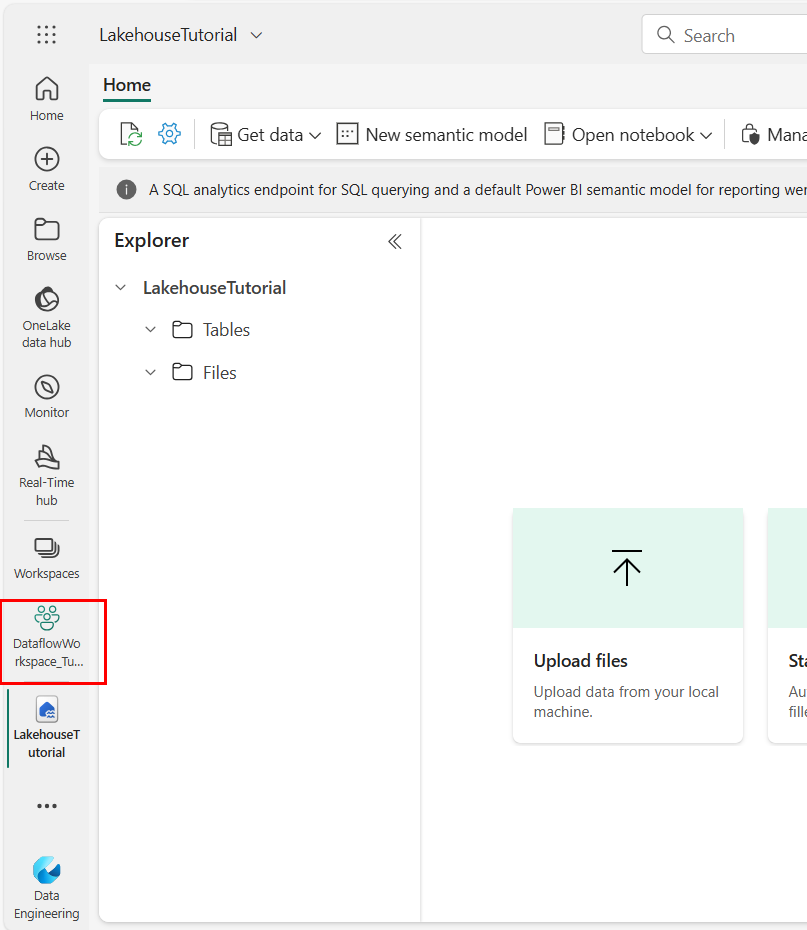

2.  In the home page for your workspace, select **+ New** dropdown.

> 

3.  From the dropdown menu, select **New Dataflow Gen2**.

4.  This will open the Power Query editor for your new dataflow.

5.  In the Power Query editor, Select **Import from a Text/CSV file**.

6.  Create a new data source with the following settings and
    Select **Next** to preview the file data.

- **Link to file**: *Selected*

- **File path or
  URL**: https://raw.githubusercontent.com/MicrosoftLearning/dp-data/main/orders.csv

- **Connection**: Create new connection

- **data gateway**: (none)

- **Authentication kind**: Anonymous

Then select, **Next**.

> 

7.  Select **Create** and the **Publish** the data source. The Power
    Query editor shows the data source and an initial set of query steps
    to format the data, as shown here:

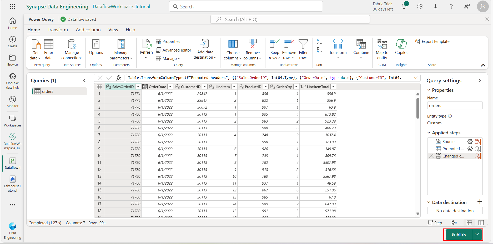

8.  On the toolbar ribbon, select the **Add column** tab.

9.  Then select **Custom column** to create a new column.

10. Set the **New column name** to MonthNo , select the **Data type**
    dropdown and set the **Data type** to **Whole Number** and then add
    the following formula: Date.Month(\[OrderDate\]).

11. Select **OK** to create the column and notice how the step to add
    the custom column is added to the query. The resulting column is
    displayed in the data pane:

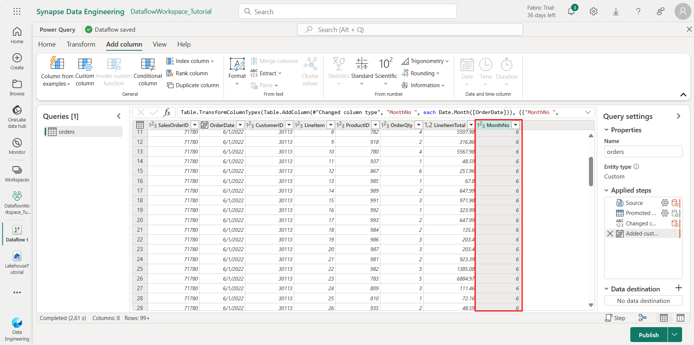

Check and confirm that the data type for the OrderDate column is set to
Date and the data type for the newly created column MonthNo is set to
Whole Number.

**Tip:** In the Query Settings pane on the right side, notice
the **Applied Steps** include each transformation step. At the bottom,
you can also toggle the **Diagram flow** button to turn on the Visual
Diagram of the steps.

Steps can be moved up or down, edited by selecting the gear icon, and
you can select each step to see the transformations apply in the preview
pane.

## Task 4: Add data destination for Dataflow

1.  On the toolbar ribbon, select the **Home** tab.

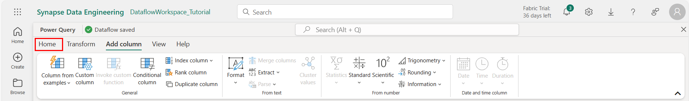

2.  Then in the **Add data destination** drop-down menu,
    select **Lakehouse**.

> **Note:** If this option is grayed out, you may already have a data
> destination set. Check the data destination at the bottom of the Query
> settings pane on the right side of the Power Query editor. If a
> destination is already set, you can change it using the gear.

3.  In the **Connect to data destination** dialog box, set the
    connections as **Create new connection**, and add the
    **Authentication kind** as **Organizational account.**

> Next, **Sign in** using your Power BI organizational account to set
> the identity that the dataflow uses to access the Lakehouse.
> Select **Next** .

4.  In the list of available workspaces, find your workspace and select
    the Lakehouse you created in it at the start of this exercise. Then
    specify a new table named **orders**:

5.  On the **Choose destination settings** page, select **Append** and
    then **Save settings**.

**Note:** We suggest using the *Power query* editor for updating data
types, but you can also do so from this page, if you prefer.

6.  On the Menu bar, open **View** and select **Diagram view**. Notice
    the **Lakehouse** destination is indicated as an icon in the query
    in the Power Query editor.

7.  Select **Publish** to publish the dataflow. Then wait for
    the **Dataflow 1** dataflow to be created in your workspace.

8.  Once published, you can click on the ellipsis **(…)** next to the
    dataflow in your workspace.

9.  Select **Properties**.

10. Rename your dataflow as **Dataflow_Connection** and click **Save**.

11. Your dataflow is now renamed.

## Task 5: Add a dataflow to a pipeline

You can include a dataflow as an activity in a pipeline. Pipelines are
used to orchestrate data ingestion and processing activities, enabling
you to combine dataflows with other kinds of operation in a single,
scheduled process. Pipelines can be created in a few different
experiences, including Data Factory experience.

1.  From your Fabric-enabled workspace, make sure you’re still in
    the **Data Engineering** experience. Select **New** dropdown.

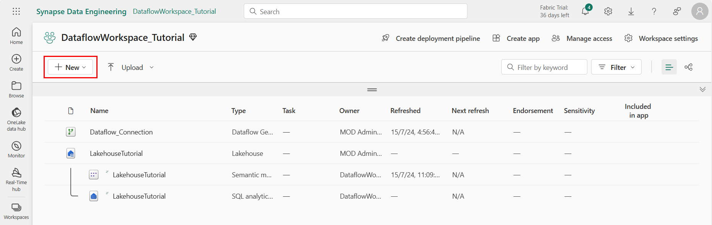

2.  From the dropdown menu, select **Data pipeline.**

> 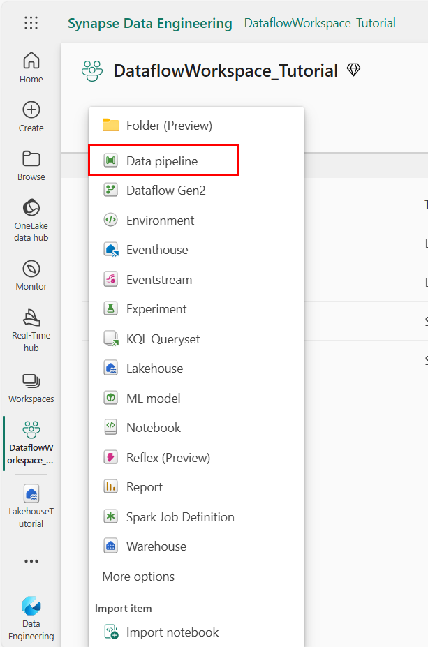

3.  Then when prompted, create a new pipeline named **Load data** and
    click **Create**.

> 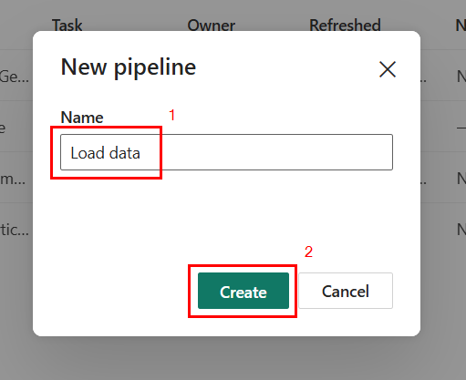

4.  The pipeline editor opens.

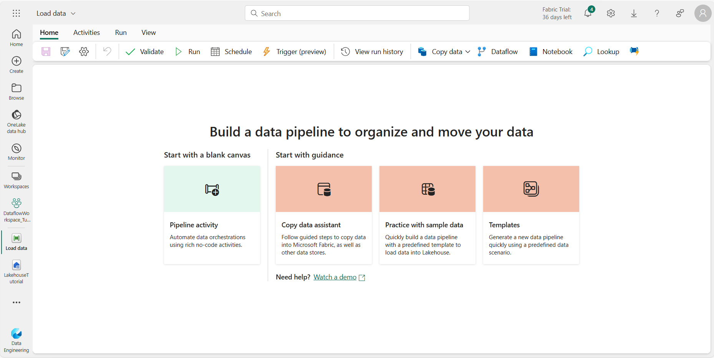

**Tip**: If the Copy Data wizard opens automatically, close it!

5.  Select **Add pipeline activity** and add a **Dataflow** activity to
    the pipeline.

6.  With the new **Dataflow** activity selected, on
    the **Settings** tab, in the **Workspace** dropdown, select your
    workspace **DataflowWorkspace_Tutorial.** Then,
    in **Dataflow** drop-down list, select **Dataflow_Connection** (the
    data flow you created previously).

> 

7.  On the **Home** tab, save the pipeline using the **🖫** (*Save*)
    icon.

8.  Use the **▷ Run** button to run the pipeline, and wait for it to
    complete. It may take a few minutes.

9.  In the menu bar on the left edge, select your Lakehouse.

10. In the **…** menu for **Tables**, select **refresh**.

> 

11. Then expand **Tables** and select the **orders** table, which has
    been created by your dataflow.

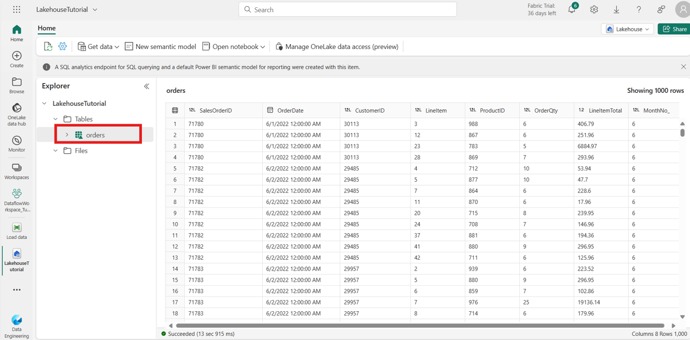

**Tip**: Use the Power BI Desktop *Dataflows connector* to connect
directly to the data transformations done with your dataflow.

You can also make additional transformations, publish as a new dataset,
and distribute with intended audience for specialized datasets.

To get data in Data Factory:

1.  On the left side of Data Factory, select **Workspaces** (but
    not **My Workspace**).

2.  From your Data Factory workspace, select **New** \> **Dataflow Gen2
    (Preview)** to create a new dataflow.

3.  In Power Query, either select **Get data** in the ribbon or
    select **Get data from another source** in the current view.

4.  In the **Choose data source** page, use **Search** to search for the
    name of the connector, or select **View more** on the right hand
    side the connector to see a list of all the connectors available in
    Power BI service.

5.  If you choose to view more connectors, you can still
    use **Search** to search for the name of the connector, or choose a
    category to see a list of connectors associated with that category.

# Exercise 2: Create Snowflake trial account

## Task 1: Create a Snowflake account using your Microsoft email account.

1.  Fill in the required details and select **Continue**.

Note: A [free
trial](https://signup.snowflake.com/?utm_cta=quickstarts_&_fsi=NfWsJmXg&_fsi=NfWsJmXg&_fsi=NfWsJmXg&_fsi=NfWsJmXg&_fsi=NfWsJmXg&_fsi=NfWsJmXg) will
suffice. [Standard
Edition](https://docs.snowflake.com/en/user-guide/intro-editions#standard-edition) will
work for most of this lab, but if you'd like to try governance features
covered in section 4, you will
need [Enterprise](https://docs.snowflake.com/en/user-guide/intro-editions#enterprise-edition) or [Business
Critical
Edition](https://docs.snowflake.com/en/user-guide/intro-editions#business-critical-edition).

2.  Once you have logged in you will receive the Snowflake credentials
    in the email.

3.  Using the credential, log into your Snowflake account.

> 

4.  On the Homepage, select **My profile**.

5.  Here, you will find the Warehouse name in **Default role &
    warehouse** section. Note down the warehouse name to establish
    connect later.

# Exercise 3: Make the connection to a Snowflake.

## Task 1: Make the connection to a Snowflake computing warehouse in Power BI Desktop app

1.  Select **Get Data** from the **Home** ribbon in Power BI Desktop and
    Select **More**.

2.  Select **Database** from the categories on the left,
    select **Snowflake**, and then select **Connect**.

3.  In the **Snowflake** window that appears, enter the name of your
    Snowflake server in **Server** (you can copy this from URL from the
    snowflake credentials email that you received) and the name of your
    Snowflake computing warehouse in **Warehouse**. Then select **OK.**

Optionally, enter values in any advanced options that you want to use to
modify the connection query, such as a text value to use as a Role name
or a command timeout

4.  To sign in to your Snowflake computing warehouse, enter your
    username and password, and then select **Connect**.

**Note:** Once you enter your username and password for a
particular **Snowflake** server, Power BI Desktop uses those same
credentials in subsequent connection attempts. You can modify those
credentials by going to **File \> Options and settings \> Data source
settings**.

If you want to use the Microsoft account option, the Snowflake Microsoft
Entra ID integration must be configured on the Snowflake side.

5.  In **Navigator**, select one or multiple elements to import and use
    in Power BI Desktop. Then select either **Load** to load the table
    in Power BI Desktop, then load that refined set of data into Power
    BI Desktop.

6.  Select **Import** to import data directly into Power BI, then
    select **OK**.

7.  Your Snowflake data is now loaded into the Power BI Desktop. You can
    now utilize the **Visualization** panel to drag and drop the visuals
    for your data.

# Exercise 4: Creating and Configuring a Data Pipeline

## Task 1: Navigate to Power BI and Data Factory

1.  Open Power BI: Navigate to the **Power BI portal**.

2.  Access Data Factory: Select the Power BI icon in the bottom left
    corner, then select "**Data Factory**" to open the Data Factory
    homepage.

**Step 2: Create a Data Pipeline**

1.  Go to Your Workspace: Navigate to the **DataEngineeringWorkspace**
    in Microsoft Fabric.

2.  Create New Pipeline: Select "Data pipeline" and enter
    **SampleDataToLakehousePipeline** as the name for your new pipeline.

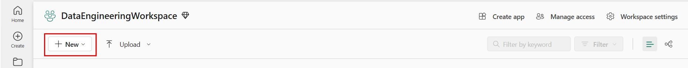

## Task 2: Configure Your Source

1.  Choose Sample Data: In the data source browser, select **Copy data
    assistant.**

2.  "Sample data" tab, then choose the "Public Holidays" sample data.

3.  Review the preview of the data from Public_Holidays and proceed by
    clicking "Next".

## Task 3: Configure Your Destination

1.  Set the destination to "**Lakehouse**".

2.  Create Lakehouse: Enter PublicHolidaysLakehouse as the Lakehouse
    name and select "Create and connect".

3.  Map Data: Configure the mapping of source data to the destination
    Lakehouse table. Choose "Tables" for the root folder and "Load to a
    new table" for load settings. Provide PublicHolidaysTable as the
    table name and click "Next".

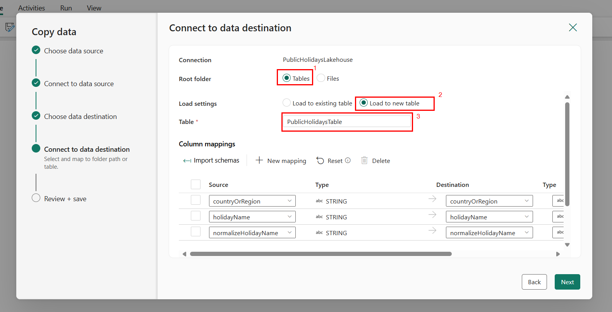

## Task 4: Review and Create Your Copy Activity

1.  Check all settings configured in the previous steps. Select
    "**Save + run**" to execute the pipeline.

2.  The Copy activity is added to your new data pipeline canvas. All
    settings including advanced settings for the activity are available
    in the tabs below the pipeline canvas when the created **Copy
    data** activity is selected.

## Summary 

By following these steps, you have learned how to create and configure a
workspace and lakehouse, design a Dataflow (Gen2) for data ingestion and
transformation, and integrate it into a data pipeline for automated data
processing. Additionally, you have explored how to connect to Snowflake
from Power Query Desktop, import and transform data, and load it into
Power BI for analysis.

You also learned how to set up a data pipeline in Microsoft Fabric's
Data Factory, which involved copying data from Snowflake into a
Lakehouse, configuring the pipeline's copy activity, and verifying the
data transfer. By completing these tasks, you have developed an
understanding of the entire data ingestion, transformation, and analysis
process using Microsoft Fabric and Snowflake.

.
