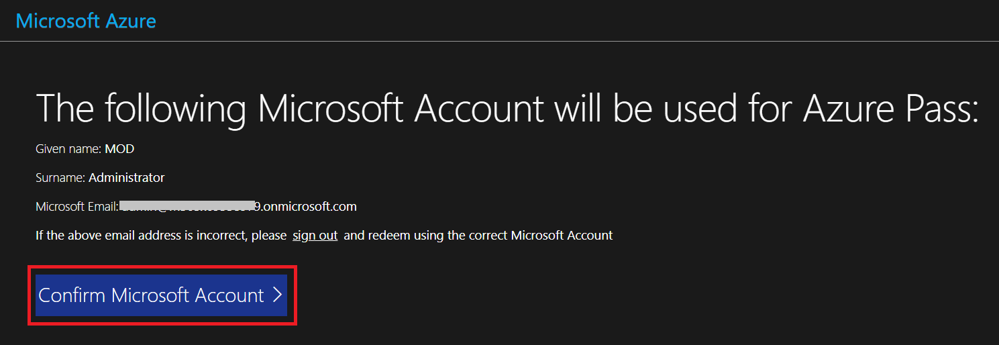
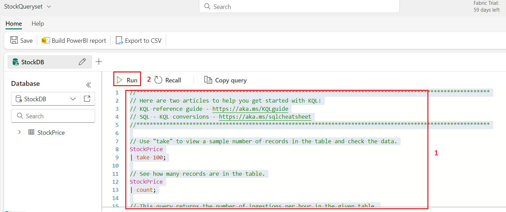
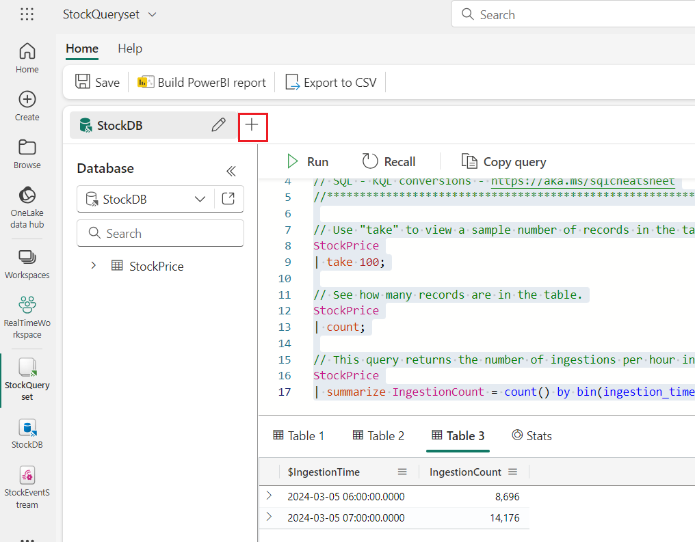
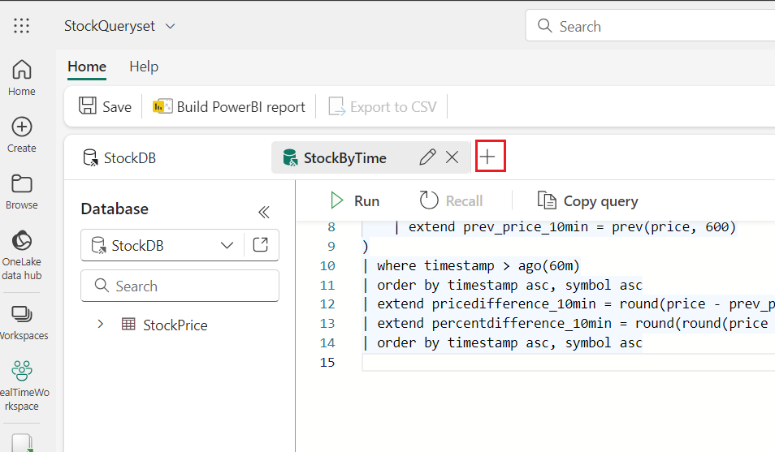
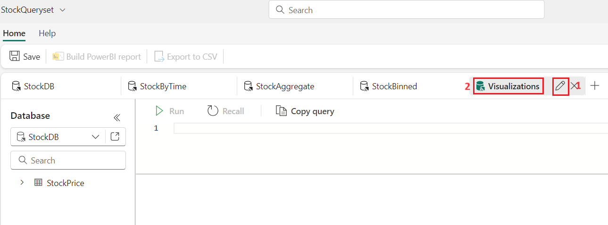
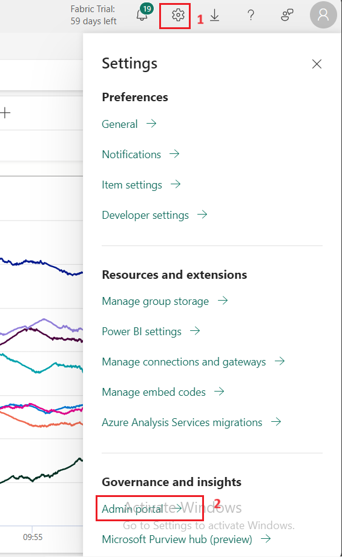
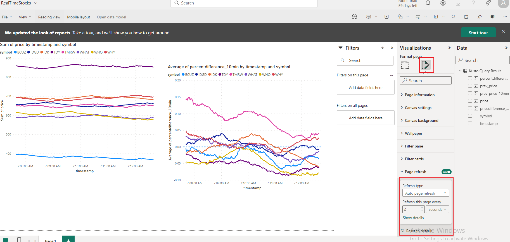

### **Use Case 2 - Real-Time Analytics and Data Warehousing with AbboCost in Microsoft Fabric**

## Introduction

In this lab, you will start by rapidly generating real-time data and
understanding how that data can be processed and visualized in Microsoft
Fabric. With the initial reporting in place, multiple modules are
available that explore data warehousing, data lakehouse architecture,
data activator, data science, and of course, real-time analytics. The
modules are designed to be cohesive but flexible -- they all involve the
same core scenario but have limited dependencies so you can consume the
modules that make the most sense for you.

The basic architecture of the solution is illustrated below. The app
deployed in the beginning of this lab (either as a docker container or
running in Jupyter notebook) will publish events to our Fabric
environment. The data is ingested into a KQL database for real-time
reporting in Power BI.

In this lab, you’ll get hands-on with a fictitious financial company
"AbboCost." AbboCost would like to set up a stock monitoring platform to
monitor price fluctuations and report on historical data. Throughout the
workshop, we'll look at how every aspect of Microsoft Fabric can be
incorporated as part of a larger solution -- by having everything in an
integrated solution, you'll be able to quickly and securely integrate
data, build reports, create data warehouses and lakehouses, forecast
using ML models, and more.

Now that our data is streaming into our KQL database, we can begin to
query and explore the data, leveraging KQL to gain insights into the
data. A KQL queryset is used to run queries, view, and transform data
from a KQL database. Like other artifacts, a KQL queryset exists within
the context of a workspace. A queryset can contain multiple queries each
stored in a tab. In this exercise, we'll create several KQL queries of
increasing complexity to support different business uses.

You will build a Synapse Data Warehouse inside Microsoft Fabric to
aggregate data from the KQL database. In Microsoft Fabric, there are two
primary ways to build a data warehouse: using a Synapse Data Warehouse,
the focus of this module, and a lakehouse.

A Synapse Data Warehouse stores its data in OneLake in Delta/Parquet
format similar to lakehouse tables. However, only Synapse Data Warehouse
offers read/write on the T-SQL endpoint. If you are migrating a data
warehouse or more familiar with T-SQL development, using a Synapse Data
Warehouse is a logical choice.

# Objectives

  - Redeem Azure Pass, and configure necessary permissions within the
    Azure portal.

  - Create fabric workspace.

  - To deploy the stock generator app via Azure Container Instance using
    an ARM template.

  - To configure Eventstream in Microsoft Fabric for ingesting real-time
    data from Azure Event Hubs, ensuring seamless integration and data
    preview for subsequent analysis.

  - To create a KQL database within Microsoft Fabric and send data from
    Eventstream to the

  - KQL database.

  - To explore stock price data using KQL, progressively developing
    queries to analyze trends, calculate price differentials, and
    visualize data for actionable insights.

  - To leverage Power BI to create dynamic, real-time reports based on
    analyzed stock data, configuring auto-refresh settings for timely
    updates and enhancing visualization for informed decision-making.

  - Create a Synapse Data Warehouse within the Fabric workspace and
    create essential staging and ETL objects to facilitate data
    processing and transformation.

  - Build a data pipeline for efficiently extracting, transforming, and
    loading (ETL) data from source systems into the Synapse Data
    Warehouse, ensuring data accuracy and consistency.

  - Create dimension and fact tables within the data warehouse to
    organize and store structured data efficiently for analytical
    purposes.

  - Implement procedures to incrementally load data into the data
    warehouse, ensuring efficient handling of large datasets while
    maintaining data integrity.

  - Create views to support data aggregation during the ETL process,
    optimizing data processing and improving pipeline performance.

  - Create semantic model in Synapse Data Warehouse, define table
    relationships, and generate a Power BI report for data
    visualization.

# Exercise 1: Environment Setup

To follow the lab exercises, a set of resources must be provisioned. At
the heart of the scenario is the real-time stock price generator script
that generates a continuous stream of stock prices that are used
throughout the workshop.

We recommend deploying the stock price generator via Azure Container
Instance because the default Spark cluster will consume a large number
of resources.

## Task 1: Redeem Azure Pass

1.  Open a new tab on your browser and enter the following link in the
    address bar: <https://www.microsoftazurepass.com/>

2.  Then, click on the **Start** button**.**

**Note**: Do not use your Company/Work Account to login to redeem the
Azure Pass, another Azure Pass will not be issued.

3.  Click on the **Resources** tab of the Lab VM and enter the **assign
    tenant credentials** to **Sign In**.

4.  Crosscheck the Email ID and then click on the **Confirm Microsoft
    Account**.

5.  Click on the **Resources** tab and copy the **Promo Code**. Navigate
    to **Enter Promo code** box and paste the Promo Code that have you
    copied, then click on the **Claim Promo Code** button**.**

6.  Enter correct details in **Your Profile** page, tick all the check
    boxes, and then click on **Sign up** button.

7.  On **Are you satisfied with your signup experience** window, enter
    your feedback and click on the **Submit** button.

8.  It would automatically redirect you to the Azure Portal and now you
    are ready to use Azure services. On **Welcome to Microsoft Azure**
    dialog box, click on the **Maybe later** button.

## **Task 2: Create a Fabric workspace**

In this task, you create a Fabric workspace. The workspace contains all
the items needed for this lakehouse tutorial, which includes lakehouse,
dataflows, Data Factory pipelines, the notebooks, Power BI datasets, and
reports.

1.  Open your browser, navigate to the address bar, and type or paste
    the following URL:
    [https://app.fabric.microsoft.com/](https://app.fabric.microsoft.com/,)
    then press the **Enter** button.

2.  In the **Microsoft Fabric** window, enter assign credentials and
    click on the **Submit** button.

> 

3.  Enter the **Administrative password** from the **Resources** tab and
    click on the **Sign in** button**.**

> 

4.  In **Stay signed in?** window, click on the **Yes** button.

> 

5.  You’ll be directed to Power BI Home page.

6.  In the **Microsoft Fabric Home** page, navigate and click on **Power
    BI** tile.

> 

7.  In the **Power BI Home** page left-sided navigation menu, navigate
    and click on **Workspaces** as shown in the below image.

> 

8.  In the Workspaces pane, click on **+** **New workspace button**

> 

9.  In the **Create a workspace** pane that appears on the right side,
    enter the following details, and click on the **Apply** button.

<table>
<thead>
<tr class="header">
<th><strong>Name</strong></th>
<th><strong>+++RealTimeWorkspaceX<em>XX</em>+++</strong> (XXX can be a unique number, you can add more numbers)</th>
</tr>
</thead>
<tbody>
<tr class="odd">
<td><strong>Advanced</strong></td>
<td>Select Trail</td>
</tr>
<tr class="even">
<td><strong>Default storage format</strong></td>
<td><strong>Small dataset storage format</strong></td>
</tr>
</tbody>
</table>

> 
> 
> 
> 
> 
> 
> 

## **Task 3: Deploy the app via Azure Container Instance**

This task deploys the stock generator app to an Azure Container Instance
using an ARM template. The app will generate stock data that publishes
the data to an Azure Event Hub, which is also configured during the
deployment of the ARM template.

To auto-deploy the resources, use these steps below.

1.  Open a new address bar and enter the following URL. If prompted to
    Sign in, then use your assign tenant
> credentials.

> \+++https://portal.azure.com/\#create/Microsoft.Template/uri/https%3A%2F%2Fraw.githubusercontent.com%2Fmicrosoft%2Ffabricrealtimelab%2Fmain%2Fresources%2Fmodule00%2Ffabricworkshop\_arm\_managedid.json+++

2.  In the **Custom deployment** window, under the **Basics** tab, enter
    the following details and click on the **Review+create** button.

<table>
<thead>
<tr class="header">
<th><strong>Subscription</strong></th>
<th><blockquote>

Select the assigned subscription

</blockquote></th>
</tr>
</thead>
<tbody>
<tr class="odd">
<td><strong>Resource group</strong></td>
<td>Click on <strong>Create new</strong>&gt; enter +++<strong>realtimeworkshop+++</strong> and select <strong>Ok</strong></td>
</tr>
<tr class="even">
<td><strong>Region</strong></td>
<td>Select <strong>West US 3</strong></td>
</tr>
</tbody>
</table>

3.  In the **Review + create** tab, navigate and click on the **Create**
    button**.**

10. Wait for the deployment to complete. The deployment will take around
    10-15 minutes.

11. After the deployment is completed, click on the **Go to resource**
    button.

4.  In **realtimeworkshop** **Resource group**, verify that the **Event
    Hub Namespace **and **Azure Container Instance (ACI)** are
    successfully deployed.

5.  Open the **Event Hub** **namespace**, which will have a name similar
    to** *ehns-XXXXXX-fabricworkshop***.

6.  In **Event Hub** **namespace** page left-sided navigation menu,
    navigate to **Settings** section and click on **Shared access
    policies**.

> 

7.   In the ***Shared access policies*** page, click on
    ***stockeventhub\_sas*** .**SAS Policy: stockeventhub\_sas** pane
    appear on the right side, copy the **primary key** and **Event Hub
    namespace** (such as *ehns-XXXXXX-fabricworkshop*) and paste them on
    a notepad, as you need them in the upcoming task. In short, you'll
    need the following:

## **Task 4: Get data with Eventstream**

1.  Go back to the Microsoft Fabric, navigate and click on **Power BI**
    at the bottom of the page, then select **Real-Time Intelligence**.
    
    

2.  On the **Synapse Real-Time Analytics** home page,
    select **Eventstream**. Name the Eventstream
    +++***StockEventStream**+++,* and click on the **Create** button.
    
    
    
    

3.  On the Eventstream, select **New source** and select **Azure *Event
    Hubs.***
    
    

4.  On the **Azure Event Hubs** configuration page, enter the below
    details and click on **Add** button.

<!-- end list -->

1.  Source name: +++**StockEventHub+++**

2.  Cloud connection: Click on the **Create new** and enter the below
    details then click on **Create** button.

<!-- end list -->

1.  In Event Hub namespace-Enter Event Hub name (the values that you
    have saved in your notepad in the **Task 3)**

2.  Event Hub : **+++stockeventhub+++**

3.  Shared Access Key Name:+++**stockeventhub\_sas+++**

4.  Shared Access Key- Enter Primary Key (the value that you have saved
    in your notepad in the **Task 3)**

<!-- end list -->

3.  Consumer group: ***$Default*** 

4.  Data format: **JSON**

8.  You will see a notification stating **Successfully added The source
    “StockEventHub,Azure Event Hubs”** was added.

> 
> 
> 
> 
> 

9.  With the Event Hub configured, click on ***Data Preview***. You
    should see events including the stock symbol, price, and timestamp.

> 

# Exercise 2: KQL Database Configuration and Ingestion

Now that our environment is fully configured, we will complete the
ingestion of the Eventstream, so that the data is ingested into a KQL
database. This data will also be stored in Fabric OneLake.

## Task 1: Create KQL Database

Kusto Query Language (KQL) is the query language used by Real-Time
analytics in Microsoft Fabric along with several other solutions, like
Azure Data Explorer, Log Analytics, Microsoft 365 Defender, etc. Similar
to Structured Query Language (SQL), KQL is optimized for ad-hoc queries
over big data, time series data, and data transformation.

To work with the data, we'll create a KQL database and stream data from
the Eventstream into the KQL DB.

1.  In the left-sided navigation menu, navigate and click on **RealTime
    workspaceXXX**, as shown in the below image.

> 

2.  In the **Real-Time Intelligence** page, navigate to +**New**
    **item** section and click on, select **Eventhouse** to create
    Eventhouse.

> 

3.  In the **New Eventhouse** dialog box, enter +++**StockDB+++**in
    the **Name** field, click on the **Create** button and open the new
    Eventhouse.

> 
> 
> 

4.  Select StockDB, click on the **OneLake availability** as shown in
    the below image to change the setting and, then click on the **Turn
    on** button to enable OneLake access.

> 
> 
> 
> 
> 

5.  After enabling OneLake, you may need to refresh the page to verify
    the OneLake folder integration is active.

> 
> 
> 

## Task 2: Send data from the Eventstream to the KQL database

1.  In the left-sided navigation menu, navigate and click on
    **StockEventStream** created in the previous task, as shown in the
    below image.

> 

6.  Our data should be arriving into our Eventstream, and we'll now
    configure the data to be ingested into the KQL database we created
    in the above task. On the Eventstream, click on +**New
    destination***,* then navigate and click on **KQL Database**.

> 

7.  On the KQL settings, select **Direct ingestion**. While we have the
    opportunity to process event data at this stage, for our purposes,
    we will ingest the data directly into the KQL database. Set the
    destination name to +++***KQL**+++*, then select your **workspace**
    and KQL database created in the above task, then click on **Add and
    Configure** button.

2.  On the first settings page, select **+New table** and enter the
    name +++*StockPrice+++* for the table to hold the data in StockDB.
    Click on the **Next** button.

3.  The next page allows us to inspect and configure the schema. Be sure
    to change the format from TXT to **JSON**, if necessary. The default
    columns of *symbol*, *price*, and *timestamp* should be formatted as
    shown in the below image; then click on the *Finish* button.

2.  On the **Summary** page, if there are no errors, you’ll see a
    **green checkmark** as shown in the below image, then click on the
    *Close* button to complete the configuration.

4.  Click on the **Refresh** button

5.  Select the **KQL** destination and then choose ‘**Data Preview’** to
    view the destination data. 

# Exercise 3: Exploring the Data

In this exercise, you'll create several KQL queries of increasing
complexity to support different business uses.

## Task 1: Create KQL queryset: StockQueryset

1.  Click on **RealTimeWorkspaceXXX** on the left-sided navigation pane.
    
    

2.  From your workspace, click on ***+** **New item \> KQL Queryset** as
    shown in the below image. In the **New KQL Queryset** dialog box,*
    enter +++***StockQueryset**+++*, then click on the **Create**
    button.

> 
> 
> 

3.  Select the ***StockDB*** and click on the **Connect** button. 

4.  The KQL query window will open, allowing you to query the data.

> 

5.  The default query code will look like the code shown in the below
    image; it contains 3 distinct KQL queries. You may
    see *YOUR\_TABLE\_HERE* instead of the ***StockPrice*** table.
    Select and delete them.

6.  

7.  In the query editor, copy and paste the following code. Select the
    entire text and click on *the **Run*** button to execute the query.
    After the query is executed, you will see the results.

**Copy**

// Use "take" to view a sample number of records in the table and check
the data.

StockPrice

| take 100;

// See how many records are in the table.

StockPrice

| count;

// This query returns the number of ingestions per hour in the given
table.

StockPrice

| summarize IngestionCount = count() by bin(ingestion\_time(), 1h);

***Note:** To run a single query when there are multiple queries in the
editor, you can highlight the query text or place your cursor so the
cursor is in the context of the query (for example, at the beginning or
end of the query) -- the current query should highlight in blue. To run
the query, click Run in the toolbar. If you'd like to run all 3 to
display the results in 3 different tables, each query will need to have
a semicolon (;) after the statement, as shown below.*

8.  The results will be displayed in 3 different tables as shown in the
    below image. Click on each table tab to review the data.

> 
> 
> 

## Task 2: New Query of StockByTime

1.  Create a new tab within the queryset by clicking on the ***+* icon**
    as shown in the below image. Rename this tab as
    +++***StockByTime***+++

> 
> 
> 
> 
> 

2.  We can begin to add our own calculations, such as calculating the
    change over time. For example,
    the [prev()](https://learn.microsoft.com/en-us/azure/data-explorer/kusto/query/prevfunction) function,
    a type of windowing function, allows us to look at values from
    previous rows; we can use this to calculate the change in price. In
    addition, as the previous price values are stock symbol specific, we
    can [partition](https://learn.microsoft.com/en-us/azure/data-explorer/kusto/query/partition-operator) the
    data when making calculations.

3.  In the query editor, copy and paste the following code. Click on
    the **Run** button to execute the query. After the query is
    executed, you will see the results.

Copy

> StockPrice
> 
> | where timestamp \> ago(75m)
> 
> | project symbol, price, timestamp
> 
> | partition by symbol
> 
> (
> 
> order by timestamp asc
> 
> | extend prev\_price = prev(price, 1)
> 
> | extend prev\_price\_10min = prev(price, 600)
> 
> )
> 
> | where timestamp \> ago(60m)
> 
> | order by timestamp asc, symbol asc
> 
> | extend pricedifference\_10min = round(price - prev\_price\_10min, 2)
> 
> | extend percentdifference\_10min = round(round(price -
> prev\_price\_10min, 2) / prev\_price\_10min, 4)
> 
> | order by timestamp asc, symbol asc

4.  In this KQL query, the results are first limited to the most recent
    75 minutes. While we ultimately limit the rows to the last 60
    minutes, our initial dataset needs enough data to lookup previous
    values. The data is then partitioned to group the data by symbol,
    and we look at the previous price (from 1 second ago) as well as the
    previous price from 10 minutes ago. Note that this query assumes
    data is generated at 1 second intervals. For the purposes of our
    data, subtle fluctuations are acceptable. However, if you need
    precision in these calculations (such as exactly 10 minutes ago and
    not 9:59 or 10:01), you'd need to approach this differently.

## Task 3: StockAggregate

1.  Create another new tab within the queryset by clicking on
    the ***+* icon** as shown in the below image. Rename this tab as
    **+++*StockAggregate*+++**

> 
> 
> 

2.  This query will find the biggest price gains over a 10-minute period
    for each stock, and the time it occurred. This query uses
    the [summarize](https://learn.microsoft.com/en-us/azure/data-explorer/kusto/query/summarizeoperator) operator,
    which produces a table that aggregates the input table into groups
    based on the specified parameters (in this case, *symbol*),
    while [arg\_max](https://learn.microsoft.com/en-us/azure/data-explorer/kusto/query/arg-max-aggregation-function) returns
    the greatest value.

3.  In the query editor, copy and paste the following code. Click on
    the **Run** button to execute the query. After the query is
    executed, you will see the results.

> **Copy**
> 
> StockPrice
> 
> | project symbol, price, timestamp
> 
> | partition by symbol
> 
> (
> 
> order by timestamp asc
> 
> | extend prev\_price = prev(price, 1)
> 
> | extend prev\_price\_10min = prev(price, 600)
> 
> )
> 
> | order by timestamp asc, symbol asc
> 
> | extend pricedifference\_10min = round(price - prev\_price\_10min, 2)
> 
> | extend percentdifference\_10min = round(round(price -
> prev\_price\_10min, 2) / prev\_price\_10min, 4)
> 
> | order by timestamp asc, symbol asc
> 
> | summarize arg\_max(pricedifference\_10min, \*) by symbol

## Task 4: StockBinned

1.  Create another new tab within the queryset by clicking on
    the ***+* icon** as shown in the below image. Rename this tab as
    +++***StockBinned+++***

2.  KQL also has a [bin()
    function](https://learn.microsoft.com/en-us/azure/data-explorer/kusto/query/bin-function),
    which can be used to bucket results based on the bin parameter. In
    this case, by specifying a timestamp of 1 hour, the result is
    aggregated for each hour. The time period can be set to minute,
    hour, day, and so on.

3.  In the query editor, copy and paste the following code. Click on
    the **Run** button to execute the query. After the query is
    executed, you will see the results.

> **Copy**

StockPrice

| summarize avg(price), min(price), max(price) by bin(timestamp, 1h),
symbol

| sort by timestamp asc, symbol asc

4.  This is particularly useful when creating reports that aggregate
    real-time data over a longer time period.

## Task 5: Visualizations

1.  Create a final new tab within the queryset by clicking on
    the ***+* icon** as shown in the below image. Rename this tab as
    +++***Visualizations+++*.** We'll use this tab to explore
    visualizing data.

> 
> 
> 

2.  KQL supports a large number
    of [visualizations](https://learn.microsoft.com/en-us/azure/data-explorer/kusto/query/render-operator?pivots=fabric) by
    using the *render* operator. Run the below query, which is the same
    as the StockByTime query, but with an additional *render* operation
    added:

3.  In the query editor, copy and paste the following code. Click on
    the **Run** button to execute the query. After the query is
    executed, you will see the results.

> Copy

StockPrice

| where timestamp \> ago(75m)

| project symbol, price, timestamp

| partition by symbol

(

order by timestamp asc

| extend prev\_price = prev(price, 1)

| extend prev\_price\_10min = prev(price, 600)

)

| where timestamp \> ago(60m)

| order by timestamp asc, symbol asc

| extend pricedifference\_10min = round(price - prev\_price\_10min, 2)

| extend percentdifference\_10min = round(round(price -
prev\_price\_10min, 2) / prev\_price\_10min, 4)

| order by timestamp asc, symbol asc

| render linechart with (series=symbol, xcolumn=timestamp,
ycolumns=price)

4.  This will render a line chart as shown in the below image.

# Exercise 4: Optimizing Power BI Reporting Efficiency

With the data loaded in the database and our initial KQL queryset
complete, we can begin to craft visualizations for real-time dashboards.

## Task 1: Configuring Refresh Rate

Our Power BI tenant needs to be configured to allow for more frequent
updating.

1.  To configure this setting, navigate to the Power BI admin portal by
    clicking on the ***Settings* **icon in the upper right corner of the
    **Fabric portal**. Navigate to Governance and insights section, then
    click on **Admin portal**.

2.  In the **Admin portal** page, navigate and click on ***Capacity
    settings**,* then click on **Trial** tab. Click on your capacity
    name.

> 

3.  Scroll down and click on ***Power BI workloads***, and
    under ***Semantic Models*** (recently renamed from *Datasets*),
    configure ***Automatic page refresh*** to ***On***, with a **minimum
    refresh interval** of **1 Seconds**. Then, click on the ***Apply***
    button.

**Note**: Depending on your administrative permissions, this setting may
not be available. Note that this change may take several minutes to
complete.

4.  On **Update your capacity workloads** dialog box, click on the
    **Yes** button.

## Task 2: Creating a basic Power BI report

1.  In the **Microsoft Fabric** page menu bar on the left side, select
    **StockQueryset**.
    
    

2.  From the ***StockQueryset*** queryset used in the previous module,
    select the ***StockByTime*** query tab.

3.  Select the query and run to view the results. Click** **on *the
    **Build Power BI report*** button in the command bar to bring this
    query into Power BI.

4.  On the report preview page, we can configure our initial chart,
    select a **line chart** to the design surface, and configure the
    report as follows. See the image below as a reference.

<!-- end list -->

  - Legend: **symbol**

  - X-axis: **timestamp**

  - Y-axis**: price**

5.  In the Power BI page, from the ribbon, click on **File** and select
    **Save**.

> 

6.  On **Just a few details first** dialog box, in **Name your file in
    Power BI** field, enter +++***RealTimeStocks**+++*. In **Save it to
    a workspace** field, click on the dropdown and select
    ***RealTimeWorkspace***. Then, click on the **Continue** button**.**

7.  In the Power BI (preview) page, click on **Open the file in Power BI
    to view, edit and get a shareable link. **

8.  On the **RealTimeStock** page, click on the **Edit** button in the
    command bar to open the report editor.

> 

9.  Select the line chart on the report. Configure a **Filter**
    for ***timestamp*** to display data for the last 5 minutes using
    these settings:

<!-- end list -->

  - Filter type: Relative time

  - Show items when the value: is in the last 5 minutes

Click on ***Apply filter*** to enable the filter. You will see a similar
type of output as shown in the below image.

## Task 3: Creating a second visual for percent change

1.  Create a second line chart, under **Visualizations**, select **Line
    chart**.

2.  Instead of plotting the current stock price, select
    the ***percentdifference\_10min*** value, which is a positive or
    negative value based off the difference between the current price
    and the value of the price from 10 minutes ago. Use these values for
    the chart:

<!-- end list -->

  - Legend: **symbol**

  - X-axis: **timestamp**

  - Y-axis: **average of percentdifference\_10min**

3.  Under the **Visualization,** select the **Analytics** represented by
    a magnifier-like icon as shown in the below image, then click on
    **Y-Axis Constant Line(1).** In the **Apply settings to**
    section**,** click on **+Add line,** then enter **Value 0.**

4.  Select the line chart on the report. Configure a **Filter**
    for ***timestamp*** to display data for the last 5 minutes using
    these settings:

<!-- end list -->

  - Filter type: Relative time

  - Show items when the value: is in the last 5 minutes

5.  In the Power BI page, from the ribbon, click on **File** and select
    **Save**

## Task 4: Configuring the report to auto-refresh

1.  Deselect the chart. On the ***Visualizations* settings**,
    enable ***Page refresh*** to automatically refresh every second or
    two, based on your preference. Of course, realistically we need to
    balance the performance implications of refresh frequency, user
    demand, and system resources.

2.  Click on **Format your report** **page** icon, navigate and click on
    **Page refresh**. Turn on the toggle. Set the Auto page refresh
    value as **2 Seconds** as shown in the below image.

3.  In the Power BI page, from the ribbon, click on **File** and select
    **Save**.

# Exercise 5: Setup Warehouse and Pipeline

## Task 1: Create a Synapse Data Warehouse in the Fabric workspace

To get started, we'll first create the Synapse Data Warehouse in our
workspace.

1.  Click on the **Real Time Analytics  icon** at the bottom of the page
    on the left side, navigate and click on **Data Warehouse** as shown
    in the below image.

2.  Select the ***Warehouse* **tile to create a new Synapse Data
    Warehouse.

3.  On the **New warehouse** dialog box, enter +++***StocksDW+++*** as
    the name and click on the **Create** button.

4.  The warehouse is largely empty.

5.  Click on ***New SQL query*** dropdown in the command bar, then
    select **New SQL query** under **Blank** section. We'll start
    building our schema in the next task.

## Task 2: Create the staging and ETL objects

1.  Run the following query that creates the staging tables that will
    hold the data during the ETL (Extract, Transform, and Load) process.
    This will also create the two schemas used -- *stg* and *ETL*;
    schemas help group workloads by type or function. The *stg* schema
    is for staging and contains intermediate tables for the ETL process.
    The *ETL* schema contains queries used for data movement, as well as
    a single table for tracking state.

2.  Note that the begin date for the watermark is arbitrarily chosen as
    some previous date (1/1/2022), ensuring all data is captured -- this
    date will be updated on each successful run.

3.  In the query editor, copy and paste the following code. Click on
    the **Run** button to execute the query. After the query is
    executed, you will see the results.

> **Copy**

/\* 1 - Create Staging and ETL.sql \*/

\-- STAGING TABLES

CREATE SCHEMA stg

GO

CREATE TABLE stg.StocksPrices

(

symbol VARCHAR(5) NOT NULL

,timestamp VARCHAR(30) NOT NULL

,price FLOAT NOT NULL

,datestamp VARCHAR(12) NOT NULL

)

GO

\-- ETL TABLES

CREATE SCHEMA ETL

GO

CREATE TABLE ETL.IngestSourceInfo

(

ObjectName VARCHAR(50) NOT NULL

,WaterMark DATETIME2(6)

,IsActiveFlag VARCHAR(1)

)

INSERT \[ETL\].\[IngestSourceInfo\]

SELECT 'StocksPrices', '1/1/2022 23:59:59', 'Y'

4.  Rename the query for reference. Right-click on **SQL query 1** in
    **Explorer** and select **Rename**.

5.  In the **Rename** dialog box, under the **Name** field, enter
    +++**Create stocks and metadata+++**, then click on the **Rename**
    button. 

> 

6.  Click on ***New SQL query*** dropdown in the command bar, then
    select **New SQL query** under **Blank** section. We'll start
    building our schema in the next step:

7.  The *sp\_IngestSourceInfo\_Update* procedure updates the watermark;
    this ensures we are keeping track of which records have already been
    imported

8.  In the query editor, copy and paste the following code. Click on
    the **Run** button to execute the query. After the query is
    executed, you will see the results.

**Copy**

/\* 1 - Create Staging and ETL.sql \*/

CREATE PROC \[ETL\].\[sp\_IngestSourceInfo\_Update\]

@ObjectName VARCHAR(50)

,@WaterMark DATETIME2(6)

AS

BEGIN

UPDATE \[ETL\].\[IngestSourceInfo\]

SET WaterMark = @WaterMark

WHERE

ObjectName = @ObjectName

END

GO

6.  Rename the query for reference later. Right-click on **SQL query 1**
    in **Explorer** and select **Rename**.

7.  In the **Rename** dialog box, under the **Name** field, enter
    +++**ETL.sql\_IngestSource+++**, then click on the **Rename**
    button. 

This should look similar to:

## Task 3: Create the data pipeline

1.  On the **StockDW** page, click on **RealTimeWorkspace** Workspace on
    the left-sided navigation menu.

> 

2.  On the **Synapse Data Warehouse RealTimeWorkhouse** home page, under
    **RealTimeWorkhouse**, click on **+New item**, then select **Data
    pipeline.**

3.  A **New pipeline** dialog box will appear, in the **Name** field,
    enter +++***PL\_Refresh\_DWH***+++ and click on the **Create**
    button**.**

> 

4.  In the ***PL\_Refresh\_DWH*** page, navigate to **Build a data
    pipeline to organize and move your data** section and click on
    **P**i**peline activity**.

5.  Then, navigate and select ***Lookup*** activity as shown in the
    below image.

6.  On the **General** tab, in the **Name field,** enter +++***Get
    WaterMark***+++

7.  Click on the **Settings** tab, enter the following details as shown
    in the below image.

<table>
<thead>
<tr class="header">
<th><strong>Connection</strong></th>
<th>Click on the dropdown and select <strong>StocksDW</strong> from the list.</th>
</tr>
</thead>
<tbody>
<tr class="odd">
<td><strong>Use query</strong></td>
<td><strong>Query</strong></td>
</tr>
<tr class="even">
<td><strong>Query </strong></td>
<td>+++<strong>SELECT * FROM [ETL].[IngestSourceInfo] WHERE IsActiveFlag = 'Y'</strong>+++</td>
</tr>
<tr class="odd">
<td><strong>First row only<em> </em></strong></td>
<td><strong><em>unchecked</em>.</strong></td>
</tr>
</tbody>
</table>

## Task 4: Build ForEach activity

This task focuses on building multiple activities within a single
ForEach activity. The ForEach activity is a container that executes
child activities as a group: in this case, if we had multiple sources to
pull data from, we'd repeat these steps for each data source.

1.  In the **Lookup - Get WaterMark** box, navigate and click on the
    right arrow to **Add an activity**. Then, navigate and
    select ***ForEach*** activity as shown in the below image.

2.  Click on the **Settings** tab, enter the items as

> \+++**@activity('Get WaterMark').output.value** +++

This should look similar to the below image:

3.  In the *ForEach*  box, click on the plus (+) symbol to add a new
    activity.

> 

4.  Select and add a ***Copy Data*** activity within *ForEach.*

> 

5.  Select **Copy data1** Activity icon, on the **General** tab, in the
    **Name field,** enter +++***Copy KQL***+++

> 

6.  Click on the **Source** tab, enter the following settings.

<table>
<thead>
<tr class="header">
<th><strong>Connection </strong></th>
<th>Select <strong>StocksDB</strong> from the dropdown.</th>
</tr>
</thead>
<tbody>
<tr class="odd">
<td><strong>Use query</strong></td>
<td><strong>Query</strong></td>
</tr>
<tr class="even">
<td><strong>Query </strong></td>
<td>
+++<strong>@concat('StockPrice </strong>

<strong>| where todatetime(timestamp) &gt;= todatetime(''', item().WaterMark,''') </strong>

<strong>| order by timestamp asc</strong>

<strong>| extend datestamp = substring(timestamp,0,10) </strong>

<strong>| project symbol, timestamp, price, datestamp </strong>

<strong>| take 500000 </strong>

<strong>| where not(isnull(price))</strong>

<strong>' )</strong> +++
</td>
</tr>
</tbody>
</table>

The *Source* tab of the activity should look similar to:

7.  Click on the **Destination** tab, enter the following settings

<table>
<thead>
<tr class="header">
<th><strong>Connection</strong></th>
<th>drop down, select <strong>StocksDW</strong> from the list</th>
</tr>
</thead>
<tbody>
<tr class="odd">
<td><strong>Table option</strong></td>
<td><strong>Use existing</strong></td>
</tr>
<tr class="even">
<td><strong>Table </strong></td>
<td>stg.StocksPrices</td>
</tr>
</tbody>
</table>

  - Under the *Advanced* section, enter the following ***Pre-copy
    script*** to truncate the table before loading the staging table:

> **+++delete** stg**.**StocksPrices+++

This step first deletes old data from the staging table, and then copies
the data from the KQL table, selecting data from the last watermark and
inserting it into the staging table. Using a watermark is important to
avoid processing the entire table; additionally, KQL queries have a
maximum rowcount of 500,000 rows. Given the current rate of data
ingested, this equates to about 3/4 of one day.

The *Destination* tab of the activity should look like:

8.  In the *ForEach*  box, click on the plus **(+)** symbol, navigate
    and select **Lookup** activity.

9.  Click on **Lookup1** icon, in the **General** tab, **Name field,**
    enter +++***Get New WaterMark***+++

> 

10. Click on the **Settings** tab, enter the following settings

<table>
<thead>
<tr class="header">
<th><strong>Connection</strong></th>
<th>drop down, select <strong>StocksDW</strong> from the list</th>
</tr>
</thead>
<tbody>
<tr class="odd">
<td><strong>Use query</strong></td>
<td><strong>Query</strong></td>
</tr>
<tr class="even">
<td><strong>Query</strong></td>
<td>+++@concat('Select Max(timestamp) as WaterMark from stg.', item().ObjectName)+++</td>
</tr>
</tbody>
</table>

11. In the *ForEach* box, click on the plus **(+)** symbol, navigate and
    select ***Stored Procedure***  activity.

> 

12. Click on the **Stored procedure** icon. On the **General** tab, in
    the **Name field,** enter +++ ***Update WaterMark*** +++

> 

13. Click on the **Settings** tab, enter the following settings.

<table>
<thead>
<tr class="header">
<th><strong>Workspace </strong></th>
<th><strong>StocksDW</strong></th>
</tr>
</thead>
<tbody>
<tr class="odd">
<td><strong>Stored procedure name </strong></td>
<td>ETL.sp_IngestSourceInfo_Update</td>
</tr>
</tbody>
</table>

  - Parameters (click *Import* to automatically add the parameter
    names):

<table>
<thead>
<tr class="header">
<th><strong>Name</strong></th>
<th><strong>Type</strong></th>
<th><strong>Value</strong></th>
</tr>
</thead>
<tbody>
<tr class="odd">
<td>ObjectName</td>
<td>String</td>
<td>@item().ObjectName</td>
</tr>
<tr class="even">
<td>WaterMark</td>
<td>DateTime</td>
<td>@activity('Get New WaterMark').output.firstRow.WaterMark</td>
</tr>
</tbody>
</table>

## Task 5: Test the Pipeline

1.  From the ***Home*** tab in the pipeline, select ***Run***.

> 

2.  In the **Save and run?** dialog box, click on **Save and run**
    button

> 

3.  This will prompt to first save the pipeline, and then validate to
    find any configuration errors. This initial run will take a few
    moments and will copy the data into the staging table.

4.  On the **PL\_Refresh\_DWH** page, click on **RealTimeWorkspace**
    Workspace on the left-sided navigation menu.

5.  Click on the **Refresh** button.

6.  In the data warehouse, data should be visible in the staging table.
    Within the data warehouse, selecting a table will show a preview of
    the data in the table. Click on StocksDW on the left-sided
    navigation menu, then click o **Schemas** in Explorer. Under
    Schemas, navigate and click on **stg**, then click on
    **StocksPrices** as shown in the below image.

9.  Click on ***New SQL query*** dropdown in the command bar, then
    select **New SQL query** under **Blank** section. We'll start
    building our schema in the next step:

8.  While we're in the data warehouse, run the script below in new SQL
    query window to reset the ingestion process. It's often handy in
    development to have a reset script to allow for incremental testing.
    This will reset the date and delete the data from the staging table.

> ***Note:** We haven't created the fact or dimensions table yet, but
> the script should still work.*

9.  In the query editor, copy and paste the following code. Click on
    the **Run** button to execute the query. After the query is
    executed, you will see the results.

> **Copy**

\-- Run this to 'RESET' the ingestion tables

exec ETL.sp\_IngestSourceInfo\_Update 'StocksPrices', '2022-01-01
23:59:59.000000'

GO

IF (EXISTS (SELECT \* FROM INFORMATION\_SCHEMA.TABLES

WHERE TABLE\_SCHEMA = 'stg' AND TABLE\_NAME = 'StocksPrices'))

BEGIN

delete stg.StocksPrices

END

GO

IF (EXISTS (SELECT \* FROM INFORMATION\_SCHEMA.TABLES

WHERE TABLE\_SCHEMA = 'dbo' AND TABLE\_NAME =
'fact\_Stocks\_Daily\_Prices'))

BEGIN

delete dbo.fact\_Stocks\_Daily\_Prices

END

GO

IF (EXISTS (SELECT \* FROM INFORMATION\_SCHEMA.TABLES

WHERE TABLE\_SCHEMA = 'dbo' AND TABLE\_NAME = 'dim\_Symbol'))

BEGIN

delete dbo.dim\_Symbol

END

GO

# Exercise 6: Build Star Schema

For the date dimension, we'll load enough values for the foreseeable
future. Date dimensions are fairly similar across all implementations
and typically hold specific date details: the day of week, month,
quarter, etc.

For the symbol dimension, we'll incrementally load that during the
pipeline -- this way, if new stocks are added at some point, they will
get added to the Symbol dimension table during the execution of the
pipeline. The symbol dimension holds additional details about each
symbol, such as company name, the stock market it trades on, etc.

We'll also create views to support the pipeline by making it easier to
load data from the staging table by aggregating the min, max, and
closing price of the stock.

## Task 1: Create the dimension and fact tables

1.  Click on ***New SQL query*** dropdown in the command bar, then
    select **New SQL query** under **Blank** section. We'll start
    building our schema in the next step.

2.  In our data warehouse, run the following SQL to create the fact and
    dimension tables. As in the previous step, you can run this ad-hoc
    or create a SQL query to save the query for future use.

3.  In the query editor, copy and paste the following code. Click on
    the **Run** button to execute the query. After the query is
    executed, you will see the results.

> **Copy**

/\* 2 - Create Dimension and Fact tables.sql \*/

\-- Dimensions and Facts (dbo)

CREATE TABLE dbo.fact\_Stocks\_Daily\_Prices

(

Symbol\_SK INT NOT NULL

,PriceDateKey DATE NOT NULL

,MinPrice FLOAT NOT NULL

,MaxPrice FLOAT NOT NULL

,ClosePrice FLOAT NOT NULL

)

GO

CREATE TABLE dbo.dim\_Symbol

(

Symbol\_SK INT NOT NULL

,Symbol VARCHAR(5) NOT NULL

,Name VARCHAR(25)

,Market VARCHAR(15)

)

GO

CREATE TABLE dbo.dim\_Date

(

\[DateKey\] DATE NOT NULL

,\[DayOfMonth\] int

,\[DayOfWeeK\] int

,\[DayOfWeekName\] varchar(25)

,\[Year\] int

,\[Month\] int

,\[MonthName\] varchar(25)

,\[Quarter\] int

,\[QuarterName\] varchar(2)

)

GO

4.  Rename the query for reference. Right-click on **SQL query** in
    Explorer and select **Rename**.

5.  In the **Rename** dialog box, under the **Name** field, enter +++
    Create Dimension and Fact tables**+++**, then click on the
    **Rename** button. 

## Task 2: Load the date dimension

1.  Click ***New SQL query*** at the top of the window. Click on ***New
    SQL query*** dropdown in the command bar, then select **New SQL
    query** under **Blank** section. We'll start building our schema in
    the next step:

2.  The date dimension is differentiated; it can be loaded once with all
    the values we'd need. Run the following script, which creates a
    procedure to populate the date dimension table with a broad range of
    values.

3.  In the query editor, copy and paste the following code. Click on
    the **Run** button to execute the query. After the query is
    executed, you will see the results.

> **Copy**

/\* 3 - Load Dimension tables.sql \*/

CREATE PROC \[ETL\].\[sp\_Dim\_Date\_Load\]

@BeginDate DATE = NULL

,@EndDate DATE = NULL

AS

BEGIN

SET @BeginDate = ISNULL(@BeginDate, '2022-01-01')

SET @EndDate = ISNULL(@EndDate, DATEADD(year, 2, GETDATE()))

DECLARE @N AS INT = 0

DECLARE @NumberOfDates INT = DATEDIFF(day,@BeginDate, @EndDate)

DECLARE @SQL AS NVARCHAR(MAX)

DECLARE @STR AS VARCHAR(MAX) = ''

WHILE @N \<= @NumberOfDates

BEGIN

SET @STR = @STR + CAST(DATEADD(day,@N,@BeginDate) AS VARCHAR(10))

IF @N \< @NumberOfDates

BEGIN

SET @STR = @STR + ','

END

SET @N = @N + 1;

END

SET @SQL = 'INSERT INTO dbo.dim\_Date (\[DateKey\]) SELECT
CAST(\[value\] AS DATE) FROM STRING\_SPLIT(@STR, '','')';

EXEC sys.sp\_executesql @SQL, N'@STR NVARCHAR(MAX)', @STR;

UPDATE dbo.dim\_Date

SET

\[DayOfMonth\] = DATEPART(day,DateKey)

,\[DayOfWeeK\] = DATEPART(dw,DateKey)

,\[DayOfWeekName\] = DATENAME(weekday, DateKey)

,\[Year\] = DATEPART(yyyy,DateKey)

,\[Month\] = DATEPART(month,DateKey)

,\[MonthName\] = DATENAME(month, DateKey)

,\[Quarter\] = DATEPART(quarter,DateKey)

,\[QuarterName\] = CONCAT('Q',DATEPART(quarter,DateKey))

END

GO

4.  From same query window, execute the above procedure by running the
    following script.

> **Copy**

/\* 3 - Load Dimension tables.sql \*/

Exec ETL.sp\_Dim\_Date\_Load

5.  Rename the query for reference. Right-click on **SQL query** in
    Explorer and select **Rename**.

6.  In the **Rename** dialog box, under the **Name** field, enter +++
    **Load Dimension tables+++**, then click on the **Rename** button. 

## Task 3: Create the procedure to load the Symbol dimension

1.  Click on ***New SQL query*** dropdown in the command bar, then
    select **New SQL query** under **Blank** section. We'll start
    building our schema in the next step.

2.  Similar to the date dimension, each stock symbol corresponds to a
    row in the Symbols dimension table. This table holds details of the
    stock, such as company name, and the market the stock is listed
    with.

3.  In the query editor, copy and paste the following code. Click on
    the **Run** button to execute the query. This will create the
    procedure that will load the stock symbol dimension. We'll execute
    this in the pipeline to handle any new stocks that might enter the
    feed.

> **Copy**

/\* 3 - Load Dimension tables.sql \*/

CREATE PROC \[ETL\].\[sp\_Dim\_Symbol\_Load\]

AS

BEGIN

DECLARE @MaxSK INT = (SELECT ISNULL(MAX(Symbol\_SK),0) FROM
\[dbo\].\[dim\_Symbol\])

INSERT \[dbo\].\[dim\_Symbol\]

SELECT

Symbol\_SK = @MaxSK + ROW\_NUMBER() OVER(ORDER BY Symbol)

, Symbol

, Name

,Market

FROM

(SELECT DISTINCT

sdp.Symbol

, Name = 'Stock ' + sdp.Symbol

, Market = CASE SUBSTRING(Symbol,1,1)

WHEN 'B' THEN 'NASDAQ'

WHEN 'W' THEN 'NASDAQ'

WHEN 'I' THEN 'NYSE'

WHEN 'T' THEN 'NYSE'

ELSE 'No Market'

END

FROM

\[stg\].\[vw\_StocksDailyPrices\] sdp

WHERE

sdp.Symbol NOT IN (SELECT Symbol FROM \[dbo\].\[dim\_Symbol\])

) stg

END

GO

7.  Rename the query for reference. Right-click on **SQL query** in
    Explorer and select **Rename**.

8.  In the **Rename** dialog box, under the **Name** field, enter +++
    **Load the stock symbol dimension** **+++**, then click on the
    **Rename** button. 

## **Task 4: Create the views**

1.  Click on ***New SQL query*** dropdown in the command bar, then
    select **New SQL query** under **Blank** section. We'll start
    building our schema in the next step.

2.  Create views that support the aggregation of the data during the
    load. When the pipeline runs, data is copied from the KQL database
    into our staging table, where we'll aggregate all of the data for
    each stock into a min, max, and closing price for each day.

3.  In the query editor, copy and paste the following code. Click on
    the **Run** button to execute the query.

/\* 4 - Create Staging Views.sql \*/

CREATE VIEW \[stg\].\[vw\_StocksDailyPrices\]

AS

SELECT

Symbol = symbol

,PriceDate = datestamp

,MIN(price) as MinPrice

,MAX(price) as MaxPrice

,(SELECT TOP 1 price FROM \[stg\].\[StocksPrices\] sub

WHERE sub.symbol = prices.symbol and sub.datestamp = prices.datestamp

ORDER BY sub.timestamp DESC

) as ClosePrice

FROM

\[stg\].\[StocksPrices\] prices

GROUP BY

symbol,
datestamp

GO

/\*\*\*\*\*\*\*\*\*\*\*\*\*\*\*\*\*\*\*\*\*\*\*\*\*\*\*\*\*\*\*\*\*\*\*\*\*\*/

CREATE VIEW stg.vw\_StocksDailyPricesEX

AS

SELECT

ds.\[Symbol\_SK\]

,dd.DateKey as PriceDateKey

,MinPrice

,MaxPrice

,ClosePrice

FROM

\[stg\].\[vw\_StocksDailyPrices\] sdp

INNER JOIN \[dbo\].\[dim\_Date\] dd

ON dd.DateKey = sdp.PriceDate

INNER JOIN \[dbo\].\[dim\_Symbol\] ds

ON ds.Symbol = sdp.Symbol

GO

4.  Rename the query for reference. Right-click on **SQL query** in
    Explorer and select **Rename**.

5.  In the **Rename** dialog box, under the **Name** field, enter +++
    **Create Staging Views** **+++**, then click on the **Rename**
    button. 

## Task 5: Add activity to load symbols

1.  On the **StockDW** page, click on **PL\_Refresh\_DWH** on the
    left-sided navigation menu.

2.  In the pipeline, add a new ***Stored Procedure*** activity
    named ***Populate Symbols Dimension*** that executes the procedure,
    which loads the stock symbols.

3.  This should be connected to the success output of the ForEach
    activity (not within the ForEach activity).

> 

4.  On the **General** tab, in the **Name field,** enter +++**Populate
    Symbols Dimension** +++

> 

5.  Click on the **Settings** tab, enter the following settings.

<table>
<thead>
<tr class="header">
<th><strong>Connection</strong></th>
<th><strong>Workspace</strong></th>
</tr>
</thead>
<tbody>
<tr class="odd">
<td><strong>Stored procedure name</strong></td>
<td>[ETL].[sp_Dim_Symbol_Load]</td>
</tr>
</tbody>
</table>

## Task 6: Create the procedure to load daily prices

1.  On the **PL\_Refresh\_DWH** page, click on **StockDW** on the
    left-sided navigation menu.

2.  Click on ***New SQL query*** dropdown in the command bar, then
    select **New SQL query** under **Blank** section. We'll start
    building our schema in the next step.

3.  Next, run the below script to create the procedure that builds the
    fact table. This procedure merges data from staging into the fact
    table. If the pipeline is running throughout the day, the values
    will be updated to reflect any changes in the min, max, and closing
    price.

> **Note**: Currently, Fabric data warehouse does not support the T-SQL
> merge statement; therefore, data will be updated and then inserted as
> needed.

4.  In the query editor, copy and paste the following code. Click on
    the **Run** button to execute the query.

/\* 5 - ETL.sp\_Fact\_Stocks\_Daily\_Prices\_Load.sql \*/

CREATE PROCEDURE \[ETL\].\[sp\_Fact\_Stocks\_Daily\_Prices\_Load\]

AS

BEGIN

BEGIN TRANSACTION

UPDATE fact

SET

fact.MinPrice = CASE

WHEN fact.MinPrice IS NULL THEN stage.MinPrice

ELSE CASE WHEN fact.MinPrice \< stage.MinPrice THEN fact.MinPrice ELSE
stage.MinPrice END

END

,fact.MaxPrice = CASE

WHEN fact.MaxPrice IS NULL THEN stage.MaxPrice

ELSE CASE WHEN fact.MaxPrice \> stage.MaxPrice THEN fact.MaxPrice ELSE
stage.MaxPrice END

END

,fact.ClosePrice = CASE

WHEN fact.ClosePrice IS NULL THEN stage.ClosePrice

WHEN stage.ClosePrice IS NULL THEN fact.ClosePrice

ELSE stage.ClosePrice

END

FROM \[dbo\].\[fact\_Stocks\_Daily\_Prices\] fact

INNER JOIN \[stg\].\[vw\_StocksDailyPricesEX\] stage

ON fact.PriceDateKey = stage.PriceDateKey

AND fact.Symbol\_SK = stage.Symbol\_SK

INSERT INTO \[dbo\].\[fact\_Stocks\_Daily\_Prices\]

(Symbol\_SK, PriceDateKey, MinPrice, MaxPrice, ClosePrice)

SELECT

Symbol\_SK, PriceDateKey, MinPrice, MaxPrice, ClosePrice

FROM

\[stg\].\[vw\_StocksDailyPricesEX\] stage

WHERE NOT EXISTS (

SELECT \* FROM \[dbo\].\[fact\_Stocks\_Daily\_Prices\] fact

WHERE fact.PriceDateKey = stage.PriceDateKey

AND fact.Symbol\_SK = stage.Symbol\_SK

)

COMMIT

END

GO

6.  Rename the query for reference. Right-click on **SQL query** in
    Explorer and select **Rename**.

7.  In the **Rename** dialog box, under the **Name** field, enter +++
    ETL.sp\_Fact\_Stocks\_Daily\_Prices\_Load**+++**, then click on the
    **Rename** button. 

## Task 7: Add activity to the pipeline to load daily stock prices

1.  On the **StockDW** page, click on **PL\_Refresh\_DWH** on the
    left-sided navigation menu.

2.  Add another ***Stored Procedure*** activity to the pipeline
    named ***Populate Fact Stocks Daily Prices*** that loads the stocks
    prices from staging into the fact table. Connect the success output
    of the *Populate Symbols Dimension* to the new *Populate Fact Stocks
    Daily Prices* activity.

> 
> 
> 

3.  Click on the **Settings** tab, enter the following settings.

<table>
<thead>
<tr class="header">
<th><strong>Connection</strong></th>
<th>Select <strong>StocksDW</strong> from the dropdown list</th>
</tr>
</thead>
<tbody>
<tr class="odd">
<td><strong>Stored procedure name</strong></td>
<td>[ETL].[sp_Fact_Stocks_Daily_Prices_Load]</td>
</tr>
</tbody>
</table>

## Task 8. Run the pipeline

1.  Run the pipeline by clicking on the ***Run*** button, and verify the
    pipeline runs and fact and dimension tables are being loaded.

2.  In the **Save and run?** dialog box, click on **Save and run**
    button

> 

## Task 9: Schedule the pipeline

1.  Next, schedule the pipeline to run periodically. This will vary by
    business case, but this could be run frequently (every few minutes)
    or throughout the day.

> **Note**: In this specific case, as there are roughly 700k rows per
> day, and KQL limits the query results to 500k, the pipeline must run
> at least twice per day to stay current.

2.  To schedule the pipeline, click the ***Schedule* **button (next to
    the *Run* button) and set up a recurring schedule, such as hourly or
    every few minutes.

# Exercise 7: Semantic Modeling

One last step is to operationalize the data by creating a semantic model
and viewing the data in Power BI. 

## Task 1: Create a semantic model

A semantic model, conceptually, provides an abstraction of our data for
consumption in business analytics. Typically, we expose data in our data
warehouse via semantic model that is used in Power BI. At a basic level,
they will include the relationships between tables.

*Note: Power BI Datasets have recently been renamed to Semantic Models.
In some cases, labels may not have been updated. The terms can be used
interchangeably. Read more about this change [on the Power BI
Blog](https://powerbi.microsoft.com/en-us/blog/datasets-renamed-to-semantic-models/).*

When we created our data warehouse, a default semantic model was created
automatically. We can leverage this in Power BI, but it also includes
many artifacts of the table we may not need. So, we'll create a new
semantic model with just our fact and two-dimension tables.

1.  On the **PL\_Refresh\_DWH** page, click on **StockDW** on the
    left-sided navigation menu.

2.  Click on the **refresh** icon as shown in the below image.

3.  In StockDW page, select the ***Reporting* **tab and then
    select ***New semantic model***.

> 

4.  In the New semantic model tab, enter the name as ***StocksModel*,**
    and select only the fact and dimensions table, as we are concerned
    with ***fact\_Stocks\_Daily\_Prices*, *dim\_Date*,
    and *dim\_Symbol***. Click on the **Confirm** button.

## Task 2. Add relationships

1.  On the **StockDW** page, click on **RealTimeWorkspace** on the
    left-sided navigation menu and select **StockModel**.

2.  The model designer should automatically open after creating the
    semantic model above. If it doesn't, or if you'd like to return to
    the designer at a later time, you can do so by opening the model
    from the list of resources in the workspace, and then
    selecting ***Open Data Model*** from the semantic model item.

3.  To create relationships between the fact and dimension tables, drag
    the key from the fact table to the corresponding key in the
    dimension table.

4.  For this data model, you need to define the relationship between
    different tables so that you can create reports and visualizations
    based on data coming across different tables. From
    the **fact\_Stocks\_Daily\_Prices** table, drag
    the **PriceDateKey** field and drop it on the **DateKey** field in
    the **dim\_Date** table to create a relationship. The **New
    relationship** dialog box appears.

> 

5.  In the **New relationship** dialog box:

<!-- end list -->

  - **From table** is populated with **fact\_Stocks\_Daily\_Prices** and
    the column of **PriceDateKey.**

  - **To table** is populated with **dim\_Date**  and the column of
    **DateKey**

  - Cardinality: **Many to one (\*:1)**

  - Cross filter direction: **Single**

  - Leave the box next to **Make this relationship active** selected.

  - Select **Ok.**

6.  From the **fact\_Stocks\_Daily\_Prices** table, drag
    the **Symbol\_SK** field and drop it on the **Symbol\_SK**  field
    in the **dim\_Symbol** table to create a relationship. The **New
    relationship** dialog box appears.

7.  In the **New relationship** dialog box:

<!-- end list -->

  - **From table** is populated with **fact\_Stocks\_Daily\_Prices** and
    the column of **Symbol\_Sk.**

  - **To table** is populated with **dim\_Symabol**  and the column of
    **Symbol\_Sk**

  - Cardinality: **Many to one (\*:1)**

  - Cross filter direction: **Single**

  - Leave the box next to **Make this relationship active** selected.

  - Select **Ok.**

## Task 3. Create a simple report

1.  Click on ***New Report*** to load the semantic model in Power BI.

> 

2.  While we won't have much data yet to make much of a report,
    conceptually, we can build a report similar to below, which shows a
    report after the lab has been running for a week or so (The
    lakehouse module will import additional history to allow for more
    interesting reports). The top chart shows the closing price for each
    stock on each day, while the bottom one shows the high/low/close of
    the WHO stock.

3.  In the **Power BI** page, under **Visualizations**, click to the
    **Line chart** icon to add a **Column chart** to your report.

<!-- end list -->

  - On the **Data** pane, expand **fact\_Stocks\_Daily\_Prices**  and
    check the box next to **PriceDateKey**. This creates a column chart
    and adds the field to the **X-axis**.

  - On the **Data** pane, expand **fact\_Stocks\_Daily\_Prices** and
    check the box next to **ClosePrice**. This adds the field to the
    **Y-axis.**

  - On the **Data** pane, expand **dim\_Symbol** and check the box next
    to **Symbol**. This adds the field to the **Legend**.

4.  From the ribbon, select **File** \> **Save.**

5.  In the Save your report dialog box, enter +++ **semantic
    report** +++ as the name of your report and select **your
    workspace**. Click on the **Save button**.

## Task 4:Clean up resources

If you’ve finished exploring your data warehouse, you can delete the
workspace you created for this exercise.

1.  In the bar on the left, select the icon for your workspace to view
    all of the items it contains.

> 

2.  In the **…** menu on the toolbar, select **Workspace settings**.

3.  In the **General** section, select **Remove this workspace**.

## **Summary**

In this lab, you’ve signed up for the Microsoft Fabric trial and
redeemed Azure Pass, followed by configuring permissions and creating
necessary resources within the Azure portal such as Fabric Capacity,
Workspace, and Storage Account. Then, you’ve deployed the stock
generator app via Azure Container Instance using an ARM template to
generate real-time stock data. Additionally, you’ve configured
Eventstream in Microsoft Fabric to ingest data from Azure Event Hubs and
prepared the KQL Database to store this data efficiently. In this lab,
you’ve established a fully functional environment to proceed with
subsequent lab exercises related to real-time analytics and data
processing.

You embarked on a comprehensive exploration of stock price data using
Kusto Query Language (KQL). Starting with the creation of a KQL queryset
named "StockQueryset," you executed a series of increasingly complex
queries to analyze various facets of the data. From viewing sample
records to calculating price differentials over time and identifying
significant price gains, each query unveils valuable insights into the
dynamics of stock prices. By leveraging windowing functions, aggregation
techniques, and data partitioning, you gained a deeper understanding of
stock price trends and fluctuations.

Then, you’ve shifted the focus to optimizing Power BI reporting
efficiency, where you configured refresh rates and crafted dynamic
visualizations for real-time dashboards. By configuring refresh rates in
the Power BI admin portal and creating Power BI reports based on the
previously defined KQL queries, you ensured timely updates and enabled
insightful visualization of stock price data. Through tasks like
creating visualizations for percent change and configuring auto-refresh
settings, you harnessed the full potential of Power BI to drive informed
decision-making and enhanced business intelligence capabilities.

You’ve configured a Synapse Data Warehouse in the Fabric workspace and
established a robust data pipeline for data processing. You’ve begun
this lab with creating the Synapse Data Warehouse and then proceeded to
create staging and ETL objects necessary for data transformation. You’ve
created schemas, tables, stored procedures, and pipelines to manage data
flow efficiently.

Then, you’ve delved into building dimension and fact tables essential
for organizing data effectively for analytical purposes. You’ve created
tables for storing daily stock prices, symbol details, and date
information. Additionally, procedures are developed to load dimension
tables with relevant data and populate fact tables with daily stock
prices.

You’ve created a semantic model in Synapse Data Warehouse, focusing on
essential fact and dimension tables. After establishing the semantic
model named "StocksModel," you’ve established relationships between the
fact\_Stocks\_Daily\_Prices table and the dim\_Date and dim\_Symbol
tables to enable cohesive data analysis. Overall, this lab provides a
comprehensive understanding of setting up a data warehouse environment
and building a reliable data pipeline for analytics.
